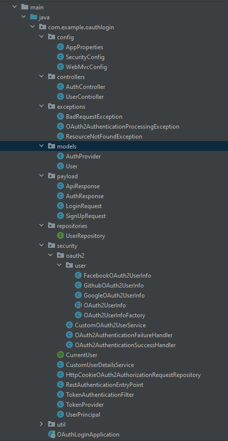

# OAuth-Login

Spring Boot OAuth2 Social Login


## What is OAuth

OAuth is an open standard for access delegation, that allows Internet users to offer websites or applications access to their information on other websites without having to give them their passwords. Companies like Amazon, Google, Facebook, Microsoft, and Twitter employ this technology to let users exchange information about their accounts with third-party applications and websites.


## The Demo App

This app is made with spring boot, MySQL and React. And it uses the following dependencies :

* Spring Web
* Spring Security
* Spring Data JPA
* MySQL Driver
* OAuth2 Client
* JWT library 


## Setting up the Backend Server

* Create a MySQL database : 

make sure to create a database named `spring_social` and specify correct values for `spring.datasource.username` and `spring.datasource.password` and replace them with your MySQL username and password.

```yaml
spring:
     datasource:
         url: jdbc:mysql://localhost:3306/spring_social?useSSL=false
         username: <YOUR_DB_USERNAME>
         password: <YOUR_DB_PASSWORD>
```


* Specify OAuth2 Provider **ClientId's** and **ClientSecrets** :

```yaml
spring:
  datasource:
    url: jdbc:mysql://localhost:3306/spring_social?useSSL=false&serverTimezone=UTC&useLegacyDatetimeCode=false
    username: root
    password: root

  jpa:
    show-sql: true
    hibernate:
      ddl-auto: update
      naming-strategy: org.hibernate.cfg.ImprovedNamingStrategy
    properties:
      hibernate:
        dialect: org.hibernate.dialect.MySQL5InnoDBDialect
  security:
   oauth2:
     client:
       registration:
         google:
           clientId: <GOOGLE_CLIENT_ID>
           clientSecret: <GOOGLE_CLIENT_SECRET>
           redirectUriTemplate: "{baseUrl}/oauth2/callback/{registrationId}"
           scope:
             - email
             - profile
         facebook:
           clientId: <FACEBOOK_CLIENT_ID>
           clientSecret: <FACEBOOK_CLIENT_SECRET>
           redirectUriTemplate: "{baseUrl}/oauth2/callback/{registrationId}"
           scope:
             - email
             - public_profile
         github:
           clientId: <GITHUB_CLIENT_ID>
           clientSecret: <GITHUB_CLIENT_SECRET>
           redirectUriTemplate: "{baseUrl}/oauth2/callback/{registrationId}"
           scope:
             - user:email
             - read:user
       provider:
         facebook:
           authorizationUri: https://www.facebook.com/v3.0/dialog/oauth
           tokenUri: https://graph.facebook.com/v3.0/oauth/access_token
           userInfoUri: https://graph.facebook.com/v3.0/me?fields=id,first_name,middle_name,last_name,name,email,verified,is_verified,picture.width(250).height(250)
app:
  auth:
    tokenSecret: 926D96C90030DD58429D2751AC1BDBBC
    tokenExpirationMsec: 864000000
  oauth2:
    authorizedRedirectUris:
      - http://localhost:3000/oauth2/redirect
      - myandroidapp://oauth2/redirect
      - myiosapp://oauth2/redirect
```

* Run OAuthLoginApplication :

```bash
 mvn spring-boot:run
```

## Setting up the Frontend Server (Front-end)

```bash
cd react-social
npm install && npm start
```

## Project structure



## Overview of the project 

here I will be specifying what each class does and it's role in the app.

### AppProperties

It is used to bind all the configurations prefixed with `app`.

### WebMvcConfig

it is used to enable CORS (Cross-Origin Resource Sharing) so that our frontend client can access the APIs from a different origin.

### User

it is the main database entity class of our application. It contains information about the user that we wish to store in our MySQL database as well as information about the authentication provider. Following is the definition of the `AuthProvider` enum.

### AuthProvider

```java
package com.example.oauthlogin.models;

public enum AuthProvider {
    local,
    facebook,
    google,
    github
}
```

### UserRepository

the repository layer for accessing data from the database. The following `UserRepository` interface provides database functionalities for the `User` entity.

### SecurityConfig

The following SecurityConfig class is the most vital part of our security implementation. It contains configurations for both OAuth2 social login as well as email and password based login (OAuth and local login).

### OAuth2AuthenticationSuccessHandler

On successful authentication, Spring security invokes the `onAuthenticationSuccess()` method of the `OAuth2AuthenticationSuccessHandler` configured in `SecurityConfig`.

In this method, we perform validations, create a JSON Web Token , and redirect the user to the `redirect_uri` specified by the client with the JWT token added in the query string.

### OAuth2AuthenticationFailureHandler

In case of any error during OAuth2 authentication, Spring Security invokes the `onAuthenticationFailure()` method of the `OAuth2AuthenticationFailureHandler` that we have configured in `SecurityConfig`.

It sends the user to the frontend client with an error message added to the query string

### AuthController

Is the controller used to handle email and password based authentication (local).

### TokenProvider

This class contains code to generate and verify JSON Web Tokens.

### TokenAuthenticationFilter

This class is used to read JWT authentication token from the request, verify it, and set Spring Security’s `SecurityContext` if the token is valid.

### RestAuthenticationEntryPoint

This class is invoked when a user tries to access a protected resource without authentication.

### UserPrincipal

The `UserPrincipal` class represents an authenticated Spring Security principal. It contains the details of the authenticated user.

### UserController - User APIs

The `UserController` class contains a protected API to get the details of the currently authenticated user

